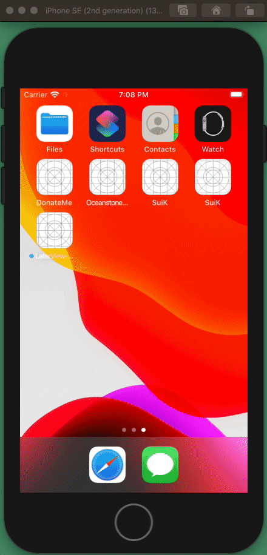

# LaterView

Create a View Later.

## Example Video



## Example Usage

```swift
import UIKit
import SwiftUIKit
import LaterView

class ViewController: UIViewController {
    
    override func viewDidLoad() {
        super.viewDidLoad()
        
        view.embed {
            UIView.later { later in
                return later
                    .fetch(url: URL(string: "https://jsonplaceholder.typicode.com/todos/1")!)
                    .flatMap { data, response, error in
                        if let error = error {
                            return later.main {
                                VStack {
                                    [
                                        Image(.red),
                                        Label("Error: \(error)")
                                    ]
                                }
                            }
                        }
                        
                        guard let data = data else {
                            return later.main {
                                List(defaultCellHeight: 256) {
                                    [
                                        Label("Response: \(String(describing: response))")
                                            .number(ofLines: 100)
                                    ]
                                }
                            }
                        }
                        
                        return later.main {
                            Label("\(String(data: data, encoding: .utf8) ?? "-1")")
                                .number(ofLines: 10)
                                .padding()
                        }
                }
            }
        }
    }
}
```
